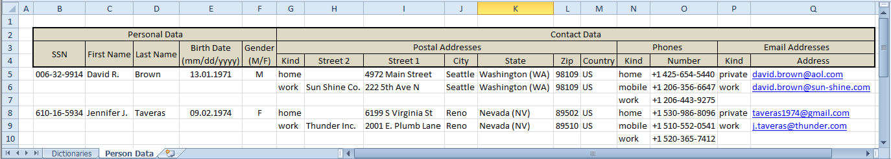
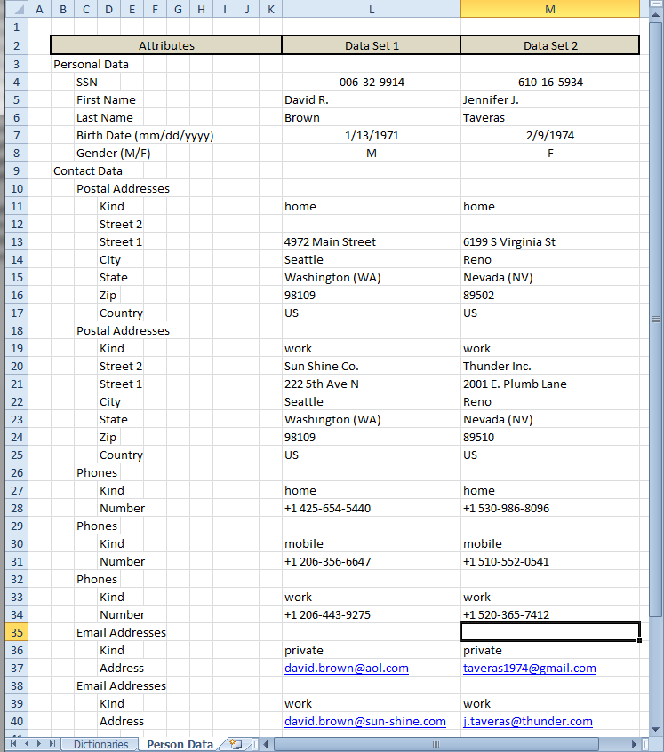

# Calc Table (based) Data Provider

**Content**

* [Introduction](#introduction)
* [Examples](#examples)
    * [Sample Data](#sample-data)
    * [Landscape format representation](#landscape-format-representation)
    * [Portrait format representation](#portrait-format-representation)
* [Application fields](#application-fields)
    * [Dictionaries](#dictionaries)
    * [Test data sets](#test-data-sets)
    * [Test case scenarios](#test-case-scenarios)
* [Vision and conclusion](#vision-and-conclusion)

## Introduction

The Calc Table (based) Data Provider is an open source framework for developing parsers which read complex data sets from Calc table documents and provide a native representation for further use within an application.

Currently supported is only the Java language, though support for Python is planned. Support for further languages is possible and may be implemented on demand.

One feature of the ground framework is its high customisability. Possible customisations comprise:
* integration of a target project's specific
    * value types
    * value notation formats (planned)
* translation rules from attribute description titles into target attribute names
* customisable data area definition rules, such as structure description and content area

The framework supports two base data representation formats within the Calc tables:
* [Landscape](#landscape-format-representation)
* [Portrait](#portrait-format-representation)

The ground framework's features can be best demonstrated based on the Examples sub-project.

## Examples

Note: here will be given only an overview of the Examples sub-project, for further details please look [here](./java/examples/).

### Sample Data

Further examples demonstrate source Calc table data representation of personal data consisting of two data records and will be read through the framework as the following data sets (here represented in the JSON-Notation):

```json
[
  {
    "personalData": {
      "sSN": "006-32-9914",
      "firstName": "David R.",
      "lastName": "Brown",
      "birthDate": "1971-01-13",
      "gender": "M"
    },
    "contactData": {
      "postalAddresses": [
        {
          "kind": "HOME",
          "street2": null,
          "street1": "4972 Main Street",
          "city": "Seattle",
          "state": "Washington (WA)",
          "zip": 98109,
          "country": "US"
        },
        {
          "kind": "WORK",
          "street2": "Sun Shine Co.",
          "street1": "222 5th Ave N",
          "city": "Seattle",
          "state": "Washington (WA)",
          "zip": 98109,
          "country": "US"
        }
      ],
      "phones": [
        {
          "kind": "HOME",
          "number": "+1 425-654-5440"
        },
        {
          "kind": "MOBILE",
          "number": "+1 206-356-6647"
        },
        {
          "kind": "WORK",
          "number": "+1 206-443-9275"
        }
      ],
      "emailAddresses": [
        {
          "kind": "PRIVATE",
          "address": "david.brown@aol.com"
        },
        {
          "kind": "WORK",
          "address": "david.brown@sun-shine.com"
        }
      ]
    }
  },
  {
    "personalData": {
      "sSN": "610-16-5934",
      "firstName": "Jennifer J.",
      "lastName": "Taveras",
      "birthDate": "1974-02-09",
      "gender": "F"
    },
    "contactData": {
      "postalAddresses": [
        {
          "kind": "HOME",
          "street2": null,
          "street1": "6199 S Virginia St",
          "city": "Reno",
          "state": "Nevada (NV)",
          "zip": 89502,
          "country": "US"
        },
        {
          "kind": "WORK",
          "street2": "Thunder Inc.",
          "street1": "2001 E. Plumb Lane",
          "city": "Reno",
          "state": "Nevada (NV)",
          "zip": 89510,
          "country": "US"
        }
      ],
      "phones": [
        {
          "kind": "HOME",
          "number": "+1 530-986-8096"
        },
        {
          "kind": "MOBILE",
          "number": "+1 510-552-0541"
        },
        {
          "kind": "WORK",
          "number": "+1 520-365-7412"
        }
      ],
      "emailAddresses": [
        {
          "kind": "PRIVATE",
          "address": "taveras1974@gmail.com"
        },
        {
          "kind": "WORK",
          "address": "j.taveras@thunder.com"
        }
      ]
    }
  }
]
```

### Landscape format representation

The Calc table sheet in Landscape format consists of the two following areas:
* header area describing data set structure
* content area with data set values

The header area is defined (in this case) through its consistent non-transparent and non-white background:



The original Excel file can be found under: [java/examples/test-data/src/test/resources/test-data-sources/Example_TestDataSets_PersonData_in_LandscapeFormat.xlsx](./java/examples/test-data/src/test/resources/test-data-sources/)

### Portrait format representation

The Calc table sheet in Portrait format consists of the three following areas:
* header area with freely choosable description texts, delimiting the data columns below
* data structure definition area, consisting of the columns spanned by the first header cell
* data content area consisting of columns spanned by header cells after the first, each header cell delimiting a single data entry

The header area is defined (in this case) through its consistent non-transparent and non-white background as well:



The original Excel file can be found under: [java/examples/test-data/src/test/resources/test-data-sources/Example_TestDataSets_PersonData_in_PortraitFormat.xlsx](./java/examples/test-data/src/test/resources/test-data-sources/)

## Fields of Application

The Calc table is still a favourite tool for many technicians and even more so for non-technical professionals. It is a very appropriate form for data representation of any kind and Calc-like programs provide many commonly used data aggregation facilities as built-in features.

In many cases it could be very beneficial to enable automatic processing of the Calc table data, avoiding its manual translation into another programmmatically processable form, such as database records, SQL scripts, source code, etc.

The greatest benefits of such an approach are:
* the responsibility for the data content specification and (!) realisation shifts to the domain area professionals
* error correction during the development time is simplified to:
    1. domain specialist corrects specification documents
    2. developer generates corrected artefacts corresponding 1:1 to the domain specialist's expectation
* elimination of error risk from manual translation of the data specification into its technical target representation

These benefits are even more pronounced where the same piece of information from specification documents is to result in multiple different artefacts.

### Dictionaries

One of the fields of application for the framework could be application of dictionary data defined in a Calc table.

So-read data might then be further used for updating a corresponding data base either directly or by generating migration scripts for a later deployment.

A representative application example can be found under [java/examples/dict](./java/examples/dict/).

### Test Data Sets

It is always beneficial to let the domain expert specify synthetic test data sets with pre-defined domain specific features and dependencies. Such data sets could be applied through either manual or automated tests.

The framework allows domain experts to specify the test data comfortably using a familiar tool and allows developers to integrate the test data 1:1 into further test routines, for example:
* to mock some componenents
* to import the data into the test data base
* to reset the system under test to one of several pre-defined states

The greatest benefit of such an approach lies in the repeatable application of test data sets within the development process and in existence of stable, consistent test data description documents that can be additively improved and adjusted upon further changes to project requirements.

A representative application example can be found under [java/examples/test-data](./java/examples/test-data/).

### Test Case Scenarios

The next level of improvement over test data sets could be description of complete test use cases within the Calc tables consisting of the following three data pieces:
* initial data stand and/or (service under test) input parameters
* expected result data stand and/or output parameters
* expected error and/or warning messages

It is conceivable to design project specific test case description documents and use them within the automated tests.

A representative application example can be found under [java/examples/test-scenarios](./java/examples/test-scenarios/).

# Vision and Conclusion

The next planned development steps will focus on:
* introduction of object references within the Calc tables
* improvement of customisation features, such as:
    * customisation of the notation form for collection typed nodes
    * configuration files for non-programmatical customisation of some basic features
    * customisation of project-wide consistent regional parameters (date/number formats etc.)
* support for Dict-/Map-like data types
* port to other programming languages, Python at least

It's also conceivable to develop specialized Calc table based data providers for:
* use in Gherkin-notation based frameworks ([Cucumber](https://cucumber.io), [Robot](https://robotframework.org/), etc.)

That's all folks. I would much appreciate to read about further ideas concerning possible framework improvements and new fields of application.

Thanks a lot in advance!
