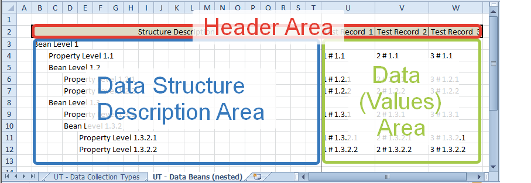
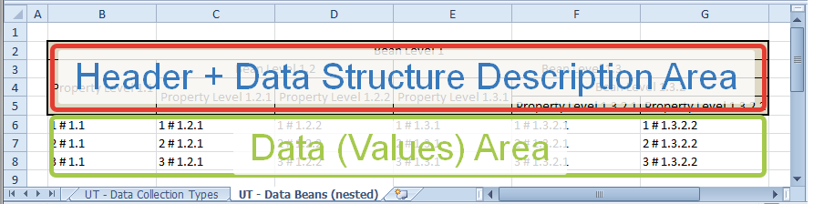
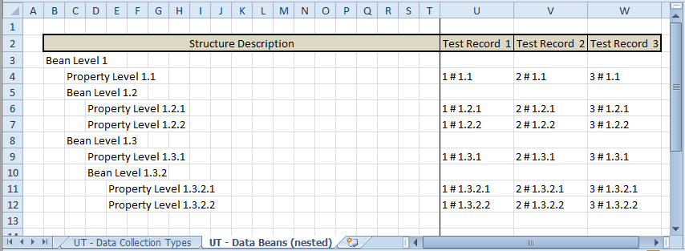
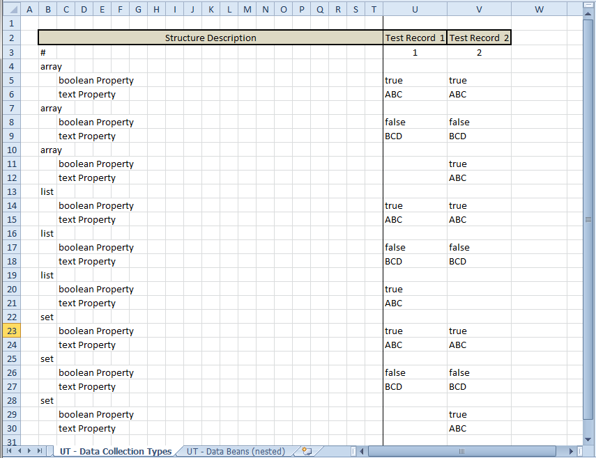
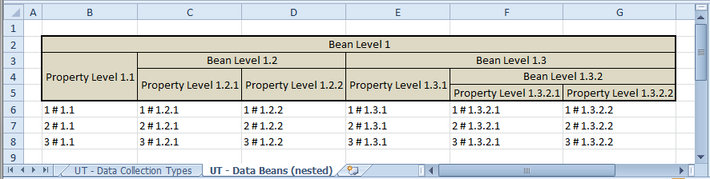
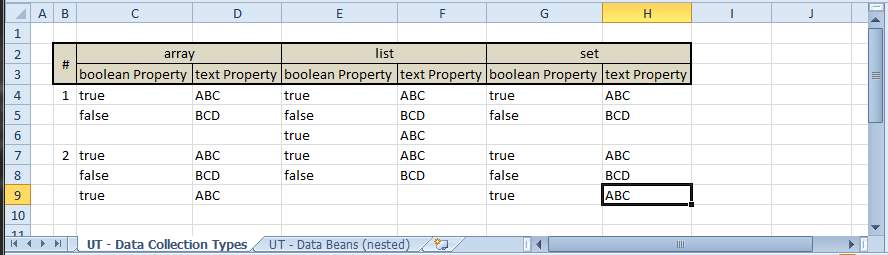

# Core Framework

**Contents**

* [Overview](#overview)
* [How To Use](#how-to-use)
* [Configuration Details](#configuration-details)
    * [Header Cell Sampler](#header-cell-sampler)
    * [Primitive Value Parser](#primitive-value-parser)
    * [Structure Name Resolver](#structure-name-resolver)
* [Calc Table Document Format](#calc-table-document-format)
    * [Common](#common)
    * [Portrait](#portrait)
    * [Landscape](#landscape)
* [Afterword](#afterword)

## Overview

The Core sub-project implements basic functionality of the "[Calc Table (based) Data Provider](https://github.com/kaftanenko/calc-table-based-data-provider)" framework (in Java) and offers some extension possibilities to adjust this functionality on yours individual project requirements.

For basic ideas and fields of application look please at projects [Home Page](https://github.com/kaftanenko/calc-table-based-data-provider).

## How To Use

The framework is available as a public Maven artifact. To use it in your Maven project, insert the following lines to your project's POM file (pom.xml):

```xml
  <dependency>
    <groupId>org.drakosha.tools.calctable</groupId>
    <artifactId>calctable-dataprovider-core</artifactId>
    <version>0.0.3</version>
  </dependency>
```

The basic functionality consist generally in reading of complex data sets containing within a single Calc table sheet. As mentioned in project description, there are two supported formats and correspondingly two specialized Sheet Data Reader implementations:

* [CalcTableSheetPortraitDataReader](./src/main/java/org/drakosha/tools/calctable/dataprovider/reader/portrait/CalcTableSheetPortraitDataReader.java)
* [CalcTableSheetLandscapeDataReader](./src/main/java/org/drakosha/tools/calctable/dataprovider/reader/landscape/CalcTableSheetLandscapeDataReader.java)

The both implement a common interface [CalcTableSheetDataReader](./src/main/java/org/drakosha/tools/calctable/dataprovider/reader/CalcTableSheetDataReader.java):

```java
package org.drakosha.tools.calctable.dataprovider.reader;

// ...

public interface CalcTableSheetDataReader {

  // ... business methods

  <DATA_TYPE> List<DATA_TYPE> readData(
      final Sheet sheet,
      final Class<DATA_TYPE> dataRecordType,
      final List<RuntimeException> messageContainer
  );
}
```

The heart of the framework is the **readData(..)** method that expects the only three parameters:

* sheet: reference to the Calc table sheet to read from
* dataRecordType: class reference defining the type of expected data records
* messageContainer: container to accumulate exceptions had arisen during the reading process

The framework uses the [Apache POI](https://poi.apache.org) framework to access the Calc Table documents and respectively re-uses some POI's classes (such as Sheet, Workbook etc.) within its own interfaces.

The framework tries to process the whole sheet through to the finish despite potential parsing errors.

The both Sheet Data Readers (for Landscape and Portrait formats) expect a configuration of the type [CalcTableDataReaderConfig](./src/main/java/org/drakosha/tools/calctable/dataprovider/reader/CalcTableDataReaderConfig.java):

```java
package org.drakosha.tools.calctable.dataprovider.reader;

// ...

public class CalcTableDataReaderConfig {

  // ... properties

  private final CalcTableHeaderCellSampler headerCellSampler;

  private final CalcTablePrimitiveValueParser primitiveValueParser;

  private final CalcTableStructureNamesResolver structureNamesResolver;

  // ...
}
```

The ingredients of this configuration structure means as follow:

* headerCellSampler: sampler allowing to recognize header area cells within a sheet
* primitiveValueParser: parser for primitive values contained in the cells within the sheet's data (values) area
* structureNamesResolver: component allowing to convert texts within the cells of the data structure description area into the target data record attribute names and to recognize the comment cells respectively

The Core sub-project offers standard implementations for each of this parts and offers to use it through the standard configuration class [CalcTableDataStandardReaderConfig](./src/main/java/org/drakosha/tools/calctable/dataprovider/reader/common/CalcTableDataStandardReaderConfig.java):

```java
package org.drakosha.tools.calctable.dataprovider.reader.common;

// ...

public class CalcTableDataStandardReaderConfig
    extends
    CalcTableDataReaderConfig
{

  // ... constructors

  public CalcTableDataStandardReaderConfig(final Locale locale) {

    super(
      CalcTableHeaderCellStandardSampler.INSTANCE__NON_TRANSPARENT_AND_NON_WHITE_BACKGROUND,
      new CalcTablePrimitiveValueStandardParser(locale),
      CalcTableStructureNamesStandardResolver.INSTANCE__TO_CAMEL_CASE__IGNORING_PARENTHESES__AND__HASH_SIGN_PREFIXED_COMMENTS
    );
  }
}
```

It is up to you to deliver your own interpretation of this configuration parts and thus to adjust the framework to your special project needs.

In the case, you are satisfied with the standard implementation, the following standard pre-configured Sheet Data Readers can be your friends:

* [CalcTableSheetPortraitStandardDataReader](./src/main/java/org/drakosha/tools/calctable/dataprovider/reader/portrait/CalcTableSheetPortraitStandardDataReader.java)
* [CalcTableSheetLandscapeStandardDataReader](./src/main/java/org/drakosha/tools/calctable/dataprovider/reader/landscape/CalcTableSheetLandscapeStandardDataReader.java)

And at last for the case, you have to read a single sheet from a Calc table document, you can find helpful the following standard implementation of a workbook reader:

* [CalcTableWorkbookDataReader](./src/main/java/org/drakosha/tools/calctable/dataprovider/reader/CalcTableWorkbookDataReader.java)

## Configuration (Details)

As mentioned above, the Sheet Data Readers configuration consist of the following parts:

* Header Cell Sampler
* Primitive Value Parser
* Structure Name Resolver

Each of this parts will be described bellow in more details.

### Header Cell Sampler

This component is an integral part of the Sheet Data Reader configuration and is responsible for recognizing the Calc table cells as belonging to the sheet header area. 

A "Header Cell Sampler" using within the Framework  must implement the [CalcTableHeaderCellSampler](./src/main/java/org/drakosha/tools/calctable/dataprovider/parser/CalcTableHeaderCellSampler.java) interface:

```java
public interface CalcTableHeaderCellSampler
		extends
		Predicate<Cell>
{

  @Override
  boolean test(Cell cell);
}
```

There is a standard implementation of this component named [CalcTableHeaderCellStandardSampler](./src/main/java/org/drakosha/tools/calctable/dataprovider/parser/common/CalcTableHeaderCellStandardSampler.java), which recognizes the header cells on their consistent non-transparent and non-white background color.

### Primitive Value Parser

This component is an integral part of the Sheet Data Reader configuration and is responsible for parsing of data cell contents into the values of corresponding data type. 

A "Primitive Value Parser" using within the Framework must implement the [CalcTablePrimitiveValueParser](./src/main/java/org/drakosha/tools/calctable/dataprovider/parser/CalcTablePrimitiveValueParser.java) interface:

```java
package org.drakosha.tools.calctable.dataprovider.parser;

// ...

public interface CalcTablePrimitiveValueParser {

  // ... business methods

  boolean isApplicableTo(
      Class<?> targetDataType
  );

  <DATA_TYPE> Optional<DATA_TYPE> parseValue(
      Cell cell,
      Class<DATA_TYPE> targetDataType,
      List<RuntimeException> messageContainer
  );
}
```

There is a standard implementation of this component named [CalcTablePrimitiveValueStandardParser](./src/main/java/org/drakosha/tools/calctable/dataprovider/parser/common/CalcTablePrimitiveValueStandardParser.java), which supports the following data types:

* Java primitive types and their Wrapper equivalents
* Enum's
* BigDecimal
* BigInteger
* Date
* LocalDate
* LocalDateTime

Very important at this point is also a description of the supported text representations of this data types within the Calt table cells, but it will stay a TODO I owe you next time. Up to this point look please into the source code to explore possible error sources and to find out the correct representation.

### Structure Name Resolver

This component is an integral part of the Sheet Data Reader configuration and is responsible for conversion of original texts within the structure description cells into the names of corresponding data object attributes. 

A "Structure Name Resolver" using within the Framework must implement the [CalcTableStructureNamesResolver](./src/main/java/org/drakosha/tools/calctable/dataprovider/parser/CalcTableStructureNamesResolver.java) interface:

```java
package org.drakosha.tools.calctable.dataprovider.parser;

public interface CalcTableStructureNamesResolver {

  boolean isComment(
      String structureNodeText
  );

  String resolvePropertyName(
      String structureNodeText
  );
}
```

There is a standard implementation of this component named [CalcTableStructureNamesStandardResolver](./src/main/java/org/drakosha/tools/calctable/dataprovider/parser/common/CalcTableStructureNamesStandardResolver.java), which solves its tasks as follows:

* isComment(..) recognizes cell text as a comment node in case it is prefixed with the "#" sign.
* resolvePropertyName(..) converts cell text into the camelCase format ignoring non-alphanumeric signs and text parts in round brackets

## Calc Table Document Format

### Common

A minimal unit the framework works with is a Calc table sheet. As mentioned several times, the framework supports two sheet layout kinds:

* Portrait
* Landscape

The sheet must contain in both cases the following three semantic relevant areas:

* header area
* data structure description area
* data (values) area

In case of the portrait layout, all this areas must be located as shown bellow:



The header area bounds the left and the right boundaries of the two other areas. Furthermore the upper boundary of the two areas begins directly after the last header area's row and the bottom one is limited only with a last existent sheet's row. The boundary between the structure description and data areas is delimited through a first header cell that have to span over columns of the structure description area.

The header and the structure description areas in case of the landscape layout are the same as shown bellow:



The data values area begins directly under the structure description area and has the same horizontal boundaries. The bottom boundary is limited only with a last existent sheet row as well.

### Portrait

The structure description in portrait layout must be build hierarchical as follows:

* the topmost hierarchy level begins at the first column of the area
* each next nested hierarchy level begins with one column offset to the right
* each row must contain one non-empty cell with the name of the corresponding data structure node



The data area contains single columns each of them relates to a single data set of the given structure. The attribute values within the data set columns must be placed on the same row as the corresponding attribute name defined within the structure description area on the left.

The names of the collection nodes must appear within the structure description area as much as the maximal amount of the collection items in the corresponding data sets. As all the data sets share the same structure description area and can contain different amount of the entries within their collection nodes, the attributes of the irrelevant collection nodes have to stay empty. In such a case the Framework will recognize it as a no-node instance and ignore it.



### Landscape

The structure description in landscape layout must be build hierarchical as follows:

* the topmost hierarchy level begins at the first row of the area
* each next nested hierarchy level begins with one row offset to the down
* the first nested node cell must be left-aligned with the cell of its parent
* it belongs to the good style to span the parent node cells over all columns of its nested nodes



The data area contains values for the data set attributes, each within the same column containing the corresponding attribute name within the structure description area. A single data set can allocate many rows depending on the amount of the items within its collection nodes and node objects nesting hierarchy.

Opposite to the collection nodes by portrait layout, no node name repetition is required in landscape. The only requirements are: 

1. Each next collection item begins on a new row under the row of the last filled cell value of the previous item.
1. Value of the collection item's first underlined attribute must be non-empty.

This way, the Framework can recognize the beginning of a collection item value correctly and parse the rest data set values.



## Afterword

The current framework description is meant no way as perfect. Please let me know if some pieces of this description are unclear, mistakable or even missing. 

You are always welcome by the [Discussions](https://github.com/kaftanenko/calc-table-based-data-provider/discussions) or [Issues](https://github.com/kaftanenko/calc-table-based-data-provider/issues). I will try my best to react so timely I can.

Thanks a lot in advance for taking a part on the project improvement!

---
[ [To Top](#core-framework) ]
