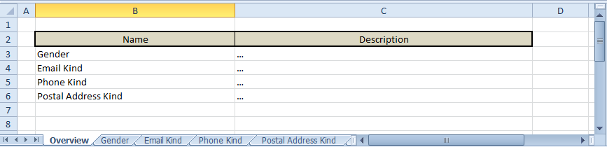
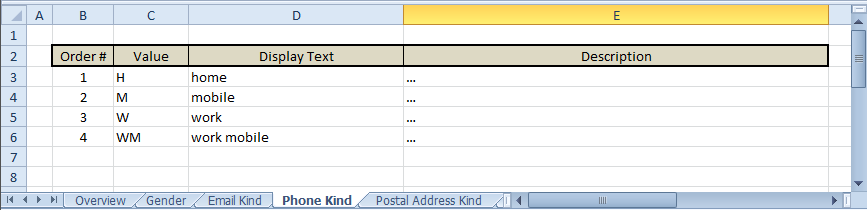

# Example: Dictionaries

**Contents**

* [Introduction](#introduction)
* [Source (Calc Table) Document](#source-calc-table-document)
* [Generating (Enumeration) Artifacts](#generating-enumeration-artifacts)
* [Technical Details](#technical-details)

## Introduction

One of the common tasks in IT projects is the management of some kind of dictionary data. There are many possibilities to realize it within a project.

The most important factors must be taken in account are:

* project role of the dictionary data:
    1. (only) as "display" data within the application interfaces
    1. as an integral part of the business logic (requires a corresponding source code representation)
* requirements in some kind of data versioning

Only in very few special cases it could be convenient to implement an admin-application to manage such a data directly at production/development time.

One of the more appropriate solutions is (IMHO) to integrate the dictionary data directly into the projects source code and to roll out it as part of the ground application within the same versioning cycle. One of the benefits of such one approach is the synchronization of the corresponding dictionary data stand and the business logic using it.

The presented example demonstrates generation of a set of enumeration classes within the target project based on the dictionary data specified within a Calc table document. If required, the same mechanism can be applied to generate some migration scripts to put this data (also) into an application database.

## Source (Calc Table) Document

The Calc table document serving as source of dictionary data is organized as set of following sheets:

- the sheet "Overview" listing names of the dictionaries containing within the document
- set of sheets named exactly as dictionaries listed within the "Overview" and containing their data

The structure of the document is invented special for this Example, feel you free to invent you own structures to fit you project specific needs.

__Overview Sheet__

The "Overview" sheet has the following structure:

* "Name" of a dictionary contained within the document
* "Description" (optional) of the corresponding dictionary, explaining its purpose

... as presented in the following snapshot:



__Dictionary Sheets__

Each of the dictionary sheets has the following standard structure:

* "Order #" to define a natural sort order for the corresponding dictionary entries
* "Value" of an entry to be used within the business logic or/and to be persisted as
* "Display Text" to represent a dictionary entry within the application (user) interface
* "Description" with explanation to the corresponding dictionary entry, is actually optional

... as presented in the following snapshot of the "Phone Kind" sheet:



The original Calc table document can be found under "[src/main/resources/data-sources/Example_Dictionaries_PersonData_in_LandscapeFormat.xlsx](./src/main/resources/data-sources)".

## Generating (Enumeration) Artifacts

As mentioned above, the Example generates enumeration classes for an other Example sub-project ([test-data](../test-data)). The generated class for the "Phone Kind" dictionary looks like:

```java
package org.drakosha.tools.calctable.dataprovider.examples.testdatasets.external.model.type;

/**
 * Enumeration representation of the dictionary 'Phone Kind'.
 * <p>
 * Description: …
 */
public enum EPhoneKind {

  // ... value constants

  HOME(
    /* value: */ "H",
    /* display text: */ "home"
  ),
  MOBILE(
    /* value: */ "M",
    /* display text: */ "mobile"
  ),
  WORK(
    /* value: */ "W",
    /* display text: */ "work"
  ),
  WORK_MOBILE(
    /* value: */ "WM",
    /* display text: */ "work mobile"
  ),
  ;
  
  // ... properties
  
  private final String value;
  
  private final String displayText;
  
  // ... constructors
  
  private EPhoneKind(
    final String value,
    final String displayText
  ) {
  
    this.value = value;
    this.displayText = displayText;
  }
  
  // ... getter methods
  
  public String getValue() {
    return value;
  }
  
  public String getDisplayText() {
    return displayText;
  }
}
```

A [FreeMarker](https://freemarker.apache.org) template using for generating such one enumeration class can be found under "[src/main/resources/generator-templates/template_enum.ftl ](./src/main/resources/generator-templates/template_enum.ftl)".


## Technical Details

**Generator Launcher**: *[Example_Dictionaries_PersonData_Enums_Generator_Launcher.java](./src/main/java/org/drakosha/tools/calctable/dataprovider/examples/dictionaries/Example_Dictionaries_PersonData_Enums_Generator_Launcher.java)*

**Enums Generator**: *[Example_Dictionaries_QuellCode_Enums_Generator.java](./src/main/java/org/drakosha/tools/calctable/dataprovider/examples/dictionaries/generator/Example_Dictionaries_QuellCode_Enums_Generator.java)*
<br />
**Source Document Parser**: *[Example_Dictionaries_CalcTable_Parser.java](./src/main/java/org/drakosha/tools/calctable/dataprovider/examples/dictionaries/parser/Example_Dictionaries_CalcTable_Parser.java)*

**Enums Generator Template**: *[template_enum.ftl ](./src/main/resources/generator-templates/template_enum.ftl)*
<br />
**Dictionaries Source Document**: *[Example_Dictionaries_PersonData_in_LandscapeFormat.xlsx](./src/main/resources/data-sources)*

---
[ [To Top](#example-dictionaries) ]
