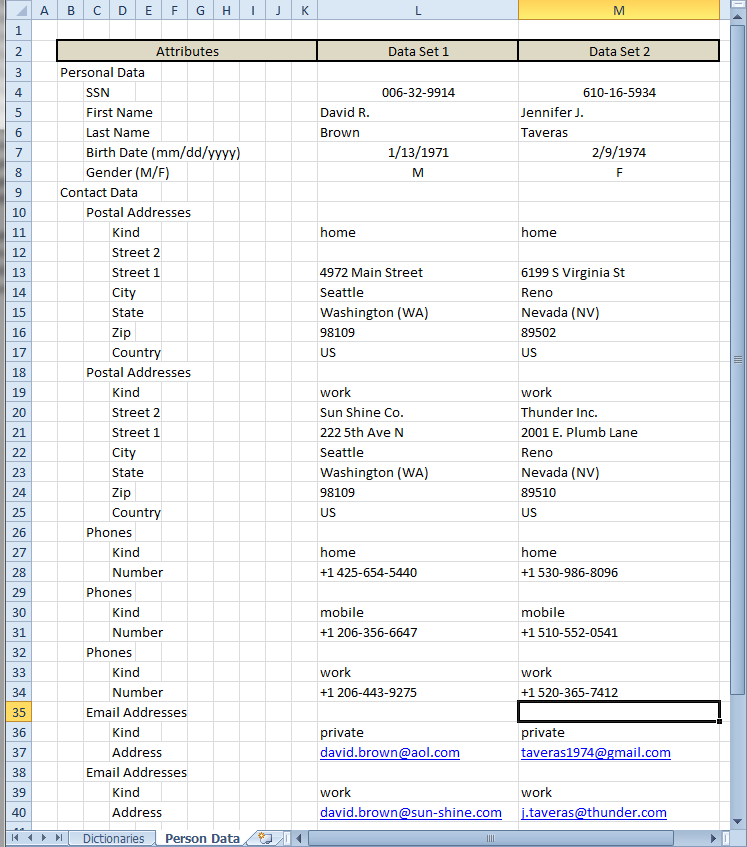

# Example: Test Data Sets

**Contents**

* [Introduction](#introduction)
* [Source (Calc Table) Document](#source-calc-table-document)
* [Technical Details](#technical-details)

## Introduction

One of the other common tasks in IT projects is the management of the test data. The problem description along with solution ways are described detailed enough within the project description.

The presented Example demonstrates use of the domain experts prepared data sets for mocking an imaginary external service within a project specific unit test.

## Source (Calc Table) Document

The Calc table document serving as test data source contains the sheets with the desired test data (in current case the single one named "Person Data"). The structure of each one must correspond to the structure of the target data record object.

The sheet "Dictionaries" in the Example doesn't really matter here - it contains values for the drop-down lists within the test data sheets and can be seen as a sugar feature enabled through the Calc table application itself.

Here a snapshot of the "Person Data" sheet (in portrait format) mentioned above:

The original Excel file can be found under: "[src/test/resources/test-data-sources/Example_TestDataSets_PersonData_in_LandscapeFormat.xlsx](./src/test/resources/test-data-sources/)".

## Technical Details

**Service under Test**: [PersonDataService.java](./src/main/java/org/business/tools/calctable/dataprovider/examples/testdatasets/PersonDataService.java)
 
**External Service to mock**: [ExternalPersonDataService.java](./src/main/java/org/business/tools/calctable/dataprovider/examples/testdatasets/external/service/ExternalPersonDataService.java)
 
**Service Unit Test**: [Example_TestDataSets_PersonDataService_UnitTest.java](./src/test/java/org/business/tools/calctable/dataprovider/examples/testdatasets/Example_TestDataSets_PersonDataService_UnitTest.java)

**Generic Mock**: [AbstractCalcTableDrivenDataRepository.java](./src/test/java/org/business/tools/calctable/dataprovider/examples/testdatasets/repository/AbstractCalcTableDrivenDataRepository.java)
 
**External Service Mock**: [ExternalPersonDataServiceMock.java](./src/test/java/org/business/tools/calctable/dataprovider/examples/testdatasets/repository/ExternalPersonDataServiceMock.java)

**Test Data Source Document**: [Example_TestDataSets_PersonData_in_PortraitFormat.xlsx](./src/test/resources/test-data-sources/)

---
\[ [To Top](#example-test-data-sets) \]
