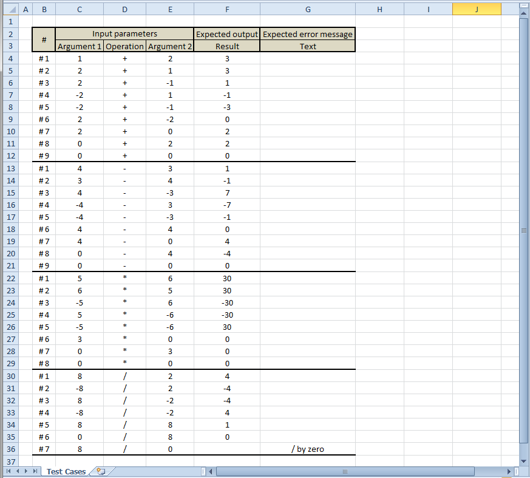
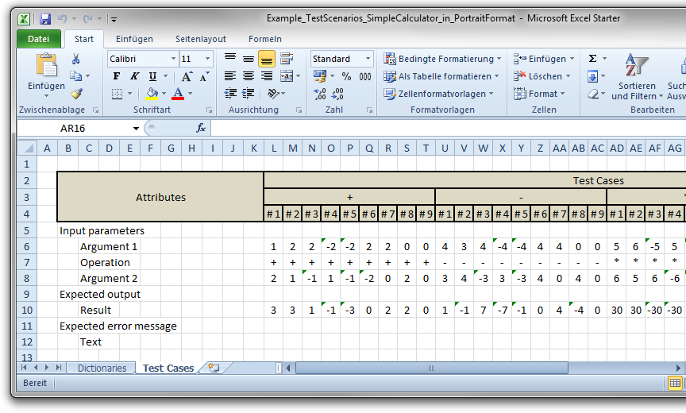
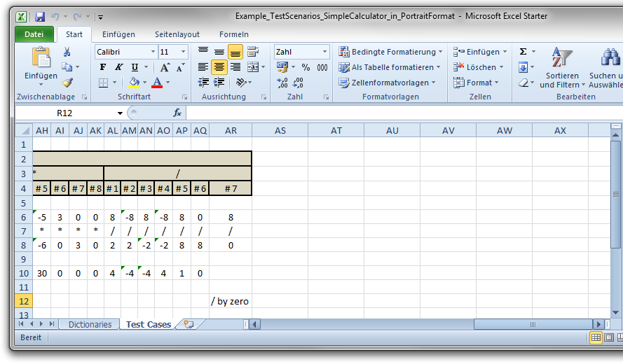

# Example: Test Scenarios

**Contents**

* [Introduction](#introduction)
* [Source (Calc Table) Document](#source-calc-table-document)
* [Technical Details](#technical-details)

## Introduction

The present Example demonstrates use of the Calc tables as a source for the data driven test scenarios. The greatest benefits of such an approach are:

* test scenarios can be specified through the non-technician domain area experts
* the Calc table representation:
    * allows to stay on the level of the service/system under test interface
    * allows to focus on the domain area requirements instead of the technical details
    * allows to beware a high level of clarity also by a very high amount of specified test cases
* such test scenarios can be made direct executable through the one time implemented automated test and as a result:
    * it eliminates the risk of translation errors by otherwise manually test scenarios implementation
    * it eliminates the risk of asynchronism between the test scenarios specification and their realization
* the change request process simplifies up to adjusting of the test scenarios data according to the new requirements and to integration/deployment this changes into the current source code stand.

## Source (Calc Table) Document

The test scenarios in the present Example can be found in two following representation formats:

* [Portrait](#-in-portrait-format)
* [Landscape](#-in-landscape-format)

Each of the formats has its own pros and cons depending on:

* complexity of the test case record
* amount of the specified test cases

Each of the factors can make the result document whether too bright or too long and therefore negatively influence the test cases clarity.

### ... in Portrait Format

The following snapshot demonstrates test scenarios defined in Portrait format for a Simple Calculator Service:

The original Excel file can be found under: "[src/test/resources/test-data-sources/Example_TestScenarios_SimpleCalculator_in_PortraitFormat.xlsx](./src/test/resources/test-scenarios)".

### ... in Landscape Format

The following snapshots demonstrate test scenarios defined in Landscape format for a Simple Calculator Service:

The original Excel file can be found under: "[src/test/resources/test-data-sources/Example_TestScenarios_SimpleCalculator_in_LandscapeFormat.xlsx](./src/test/resources/test-scenarios)".

## Technical Details

**Service under Test**: [SimpleCalculatorAsServiceUnderTest.java](./src/main/java/org/business/tools/calctable/dataprovider/examples/testscenarios/SimpleCalculatorAsServiceUnderTest.java)
 
**Service Unit Test**: [Example_TestScenarios_SimpleCalculator_UnitTest.java](./src/test/java/org/business/tools/calctable/dataprovider/examples/testscenarios/Example_TestScenarios_SimpleCalculator_UnitTest.java)

**Test Scenarios Data Record**: [Example_TestScenarios_SimpleCalculator_Record.java](./src/test/java/org/business/tools/calctable/dataprovider/examples/testscenarios/Example_TestScenarios_SimpleCalculator_Record.java)

**Test Scenarios Source Document**: [Example_TestDataSets_PersonData_in_PortraitFormat.xlsx](./src/test/resources/test-scenarios)

---
\[ [To Top](#example-test-scenarios) \]
